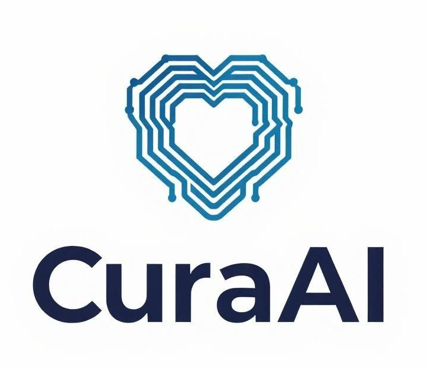

# CuraAI
### Privacy-First Voice AI Agent for Telehealth Intake

  

---

## TL;DR
CuraAI builds a privacy-first voice agent that automates telehealth intake inside secure enclaves — accelerating healthcare while keeping patient data private.

---

## Overview
CuraAI is a privacy-first voice AI agent that automates the medical intake and triage process using confidential computing and encrypted analytics.

Built with Trusted Execution Environments (TEEs) and Fully Homomorphic Encryption (FHE), CuraAI runs sensitive AI inference securely — ensuring that even system operators cannot access raw patient data.

Patients interact naturally by voice, describing their symptoms while the agent asks relevant follow-ups and structures the conversation into standardized summaries for clinicians.

Doctors receive these summaries securely — complete with likely conditions, confidence levels, and reasoning — without CuraAI ever making a medical diagnosis. 

The goal: help doctors act faster with better information, not replace them.

---

## The Problem
Healthcare systems waste immense clinical capacity on routine intake:
- 30% of clinical time is lost to manual symptom collection and administrative entry.  
- Staff shortages leave millions without timely care, especially in developing regions.  
- Privacy and compliance barriers block the adoption of most AI or digital intake tools.

These inefficiencies delay treatment, reduce the quality of care, and burden overworked clinicians — particularly in NGOs, public clinics, and resource-limited health systems.

---

## Our Solution
CuraAI automates the intake and triage layer of healthcare.  

- Voice-based AI Agent — Converses naturally with patients to gather history, symptoms, and context.  
- Intelligent Summarization — Generates structured clinical notes including symptom clusters, prior medication, family history, and relevant medical background.  
- Smart Routing — Flags urgent cases and redirects patients to appropriate general or specialist care.  
- TEE Enclaves — All inference runs inside secure enclaves, isolating patient data from any external access.  
- FHE Analytics — Health providers get encrypted demographic and intake analytics without exposing sensitive data.  

CuraAI doesn't diagnose — it prepares doctors with structured, privacy-preserving information so they can focus on treatment, not paperwork.

---

## Our Competitive Edge

  

**Uniquely positioned at the intersection of Voice-AI and Privacy-First technology:**
- **High Privacy + Voice AI**: Unlike traditional chatbots or call centers, CuraAI combines natural voice interaction with enterprise-grade privacy protection
- **Intelligent Pre-Diagnosis**: Our AI doesn't just collect data—it provides structured clinical insights while maintaining complete patient confidentiality

---

## How It Works
1. Patient describes symptoms through voice conversation.  
2. AI agent conducts a guided consultation (like a first interview).  
3. AI processes data in a TEE, asking context-specific questions.  
4. Patient approves sharing; doctor receives a structured summary with probabilities and reasoning.  
5. Encrypted analytics are aggregated using FHE — giving clinics insight without data exposure.  

Future integrations include OCR for scanning patient records, Zero-Knowledge Proofs for sensitive data provenance, and encrypted dashboards for providers.

---

## Market Impact
Healthcare intake automation represents a $50B+ global market.  
Our initial focus is the $20B Latin American telehealth sector, expanding into NGO and public health contracts estimated between $500M–$1.5B.  

Particularly strong beneficiaries include:
- Public clinics with high intake volume and limited staff  
- NGOs operating in underserved or rural regions  
- Specialized fields like reproductive assistance, maternal health, and early diagnostic programs

---

## Previous work and Roadmap

We started this project within the Aleph hackathon 2025, in which we won the [third place in the Protocol Labs AI track](https://x.com/alephhackathon/status/1962885209596076193). Now, we are working on improving the technical and business development for launch our product with the guidance from the [Lisk's Founders Track from the Crecimiento Buildathon Season](https://x.com/alephhackathon/status/1973790903635480997)

- Hackathon Repo: https://github.com/NathaliaBarreiros/CuraAI
- Hackathon Video: https://www.youtube.com/watch?v=5M4gKJ6Ipvk

### Roadmap

- Improve the AI-agent
- Deploy the agent within a TEE
- Fully integrate Zama FHE statistics
- Add OCR for digitizing paper files
- Integrate ZKPs for sensitive data provenance
- Fully build the health provider dash and improve the patient dash
- NGO pilot program
- NGO program refined & extended to private/public health centers
- Feedback on the app
- LATAM expansion
- Africa + India rollout

---

## Why It Matters
Billions of people still face care delays due to staff shortages and privacy barriers.  

CuraAI gives every patient a private, AI-powered voice that streamlines access to care — ethically and securely.

### Impact
CuraAI redefines healthcare efficiency by freeing doctors from repetitive intake work.  

NGOs and clinics can serve more patients in less time while maintaining end-to-end privacy compliance.

Every patient gets a private AI voice at the point of need, improving equity in digital health access.

### Backed by:  
3rd Place — [Protocol Labs Aleph Hackathon (AI Track)](https://x.com/alephhackathon/status/1962885209596076193)  
Lisk Founders Track — [Crecimiento Buildathon Season](https://x.com/alephhackathon/status/1973790903635480997)

---

## Quick Links
- MVP Repo: [github.com/NathaliaBarreiros/CuraAI](https://github.com/NathaliaBarreiros/CuraAI)  
- Demo Video: [YouTube](https://www.youtube.com/watch?v=5M4gKJ6Ipvk)   
- Website: [CuraAI.xyz](https://curaai.xyz)   
- X / Twitter: [@CuraAI_](https://x.com/CuraAI_)  
- LinkedIn: [CuraAI-xyz](https://linkedin.com/company/curaai-xyz)

---

## Join Our Journey

  

Follow us on [X (Twitter)](https://x.com/CuraAI_) and [LinkedIn](https://linkedin.com/company/curaai-xyz).   
Reach out directly at [nathaniel@curaai.xyz](mailto:nathaniel@curaai.xyz).
